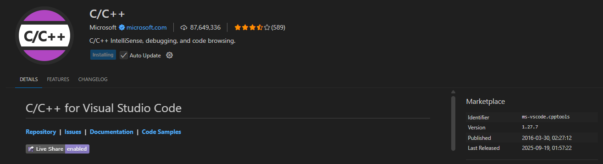

## Desenvolver programas complexos em linguagem estruturada
# C++ 

###  Instalar o MSYS2
O MSYS2 é uma plataforma que facilita a instalação de ferramentas de desenvolvimento, como o compilador GCC para C++.

Link MSYS2:

https://eduatec-my.sharepoint.com/:u:/g/personal/joao_vilares_0001476_edu_atec_pt/Ec42fco8-TFNtd25RLEl3QIBok4kTK4kGtbpy_F6T0BPmA?e=3hvmzG

https://www.msys2.org/

Abra o terminal MSYS2 e execute:

```bash
pacman -Syu
pacman -S mingw-w64-ucrt-x86_64-gcc
```

### Adicionar o GCC ao PATH do Windows C:\msys64\ucrt64\bin ao PATH.
Para compilar programas de qualquer terminal, adicione o caminho do GCC ao PATH:

Where?
: Painel de Controle → Sistema → Configurações avançadas → Variáveis de ambiente → Path


4. Testar a instalação

Abra um novo PowerShell e teste:

```bash
g++ --version
```

No VS Code, instale a extensão C/C++.


Se aparecer a versão do GCC, está tudo pronto!


### Compilar e executar  programas
No terminal, compilar o código:

```bash
g++ hello_world.cpp -o hello_world.exe // output com o nome desejado
```

Execute o programa:

```bash
 .\ hello_world.exe
```
 