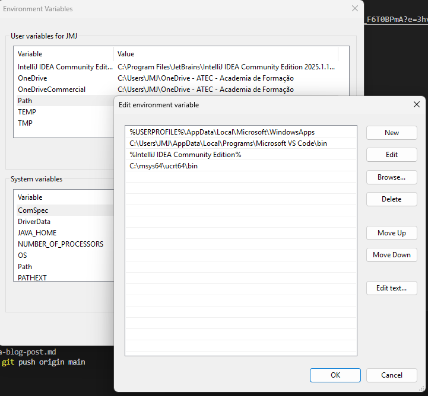
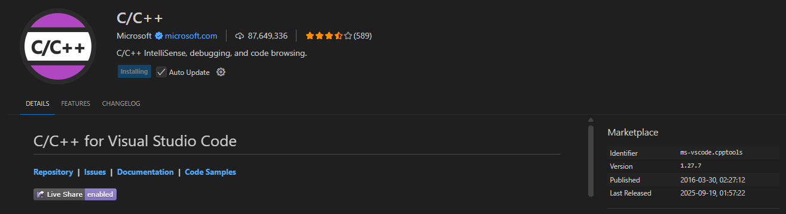

## Desenvolver programas complexos em linguagem estruturada
# C++ 

Instalar MSYS2

https://eduatec-my.sharepoint.com/:u:/g/personal/joao_vilares_0001476_edu_atec_pt/Ec42fco8-TFNtd25RLEl3QIBok4kTK4kGtbpy_F6T0BPmA?e=3hvmzG

https://www.msys2.org/

pacman -Syu
pacman -S mingw-w64-ucrt-x86_64-gcc
Adicione C:\msys64\ucrt64\bin ao PATH.


Adicione ao PATH do Windows:

Caminho típico: C:\msys64\ucrt64\bin

Painel de Controle → Sistema → Configurações avançadas → Variáveis de ambiente → Path → Novo → cole esse caminho.

Abra um novo PowerShell e teste:

g++ --version
No VS Code, instale a extensão C/C++.


 g++ .\hello_world.cpp

 .\ hello.exe

 
## Build your site

Build your site **for production**:

```bash
npm run build
```

The static files are generated in the `build` folder.

## Deploy your site

Test your production build locally:

```bash
npm run serve
```

The `build` folder is now served at [http://localhost:3000/](http://localhost:3000/).

You can now deploy the `build` folder **almost anywhere** easily, **for free** or very small cost (read the **[Deployment Guide](https://docusaurus.io/docs/deployment)**).
